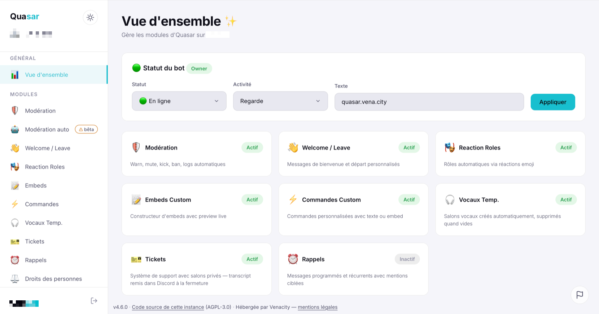

# 🌌 Quasar — Bot Discord Self-Hosted

> Toutes les fonctionnalités premium d'un bot Discord — modération, tickets, musique, reaction roles, embeds, TempVoice et dashboard web. 100% self-hosted, open source, 0 abonnement.



---

## ✨ Features

| Module | Description |
|--------|-------------|
| 🛡️ **Modération** | Warn, mute, kick, ban, clear, logs automatiques, sanctions auto |
| 👋 **Welcome / Leave** | Messages de bienvenue et départ avec embed + avatar |
| 🎭 **Reaction Roles** | Panels avec emojis, mode unique ou multiple, toggle au clic |
| ✅ **Autoroles** | Rôles attribués automatiquement à l'arrivée |
| 🔊 **Rôles vocaux** | Rôle donné en vocal, retiré à la déconnexion |
| 📝 **Embeds Custom** | Créer, sauvegarder et envoyer des embeds personnalisés |
| ⚡ **Commandes Custom** | Commandes personnalisées avec texte ou embed |
| 🎫 **Tickets** | Système de tickets, panel personnalisable — transcript envoyé dans Discord à la fermeture, jamais stocké en base |
| 🎵 **Musique** | Play depuis YouTube, Spotify, Apple Music, Deezer et + |
| 🔊 **TempVoice** | Salons vocaux temporaires avec boutons interactifs |
| 🌐 **Dashboard Web** | Tout configurer depuis un navigateur — thème clair/sombre |
| ⬆ **Auto-update** | Mise à jour en un clic depuis le dashboard avec logs temps réel |

---

## 🚀 Quick Start

### Prérequis
- [Docker](https://docs.docker.com/get-docker/) installé
- Une application bot Discord ([Developer Portal](https://discord.com/developers/applications))

### Installation en une commande

```bash
curl -sSL https://raw.githubusercontent.com/venaciteam/quasar-discord/main/install.sh | bash
```

Ou manuellement :

```bash
git clone https://github.com/venaciteam/quasar-discord.git
cd quasar-discord
./setup.sh
```

Le script te guide : il demande tes identifiants Discord, crée le `.env`, le volume Docker, build et lance le bot. C'est tout.

### Installation manuelle

<details>
<summary>Voir les étapes manuelles</summary>

#### 1. Cloner le repo

```bash
git clone https://github.com/venaciteam/quasar-discord.git
cd quasar-discord
```

#### 2. Configurer

```bash
cp .env.example .env
```

Édite le fichier `.env` avec tes informations :

| Variable | Description |
|----------|-------------|
| `DISCORD_TOKEN` | Token du bot (onglet Bot du Developer Portal) |
| `DISCORD_CLIENT_ID` | Client ID (onglet OAuth2) |
| `DISCORD_CLIENT_SECRET` | Client Secret (onglet OAuth2) |
| `CALLBACK_URL` | URL de callback OAuth2 — `http://localhost:3000/callback` par défaut. Si tu ouvres le dashboard au réseau, mets l'IP du serveur (ex: `http://192.168.1.100:3000/callback`) |
| `JWT_SECRET` | Chaîne aléatoire pour signer les JWT (génère avec `openssl rand -hex 32`) |
| `PORT` | Port du dashboard (défaut: `3000`) |
| `BIND_ADDRESS` | **Exposition du dashboard en Docker** — `127.0.0.1` (défaut) = accessible seulement depuis la machine hôte, `0.0.0.0` = ouvert au réseau |
| `DASHBOARD_HOST` | Équivalent hors Docker (lancement direct par `node index.js`). Ne pas y toucher en conteneur : le Dockerfile le force à `0.0.0.0` |
| `BOT_OWNER_ID` | Ton ID Discord — active les fonctions admin dans le dashboard (gestion du statut du bot). Pour le trouver : active le mode développeur dans Discord → clic droit sur ton profil → Copier l'identifiant |
| `INSTANCE_OPERATOR_NAME` | Qui héberge cette instance — affiché dans le dashboard (optionnel) |
| `INSTANCE_LEGAL_URL` | Lien vers tes mentions légales (optionnel) |
| `INSTANCE_SOURCE_URL` | Code source de ta version — **requis par l'AGPL si tu as modifié Quasar et que ton dashboard est accessible à d'autres** |
| `ABUSE_REPORT_URL` | Où reçois-tu les signalements d'abus (`/signaler abus`). **Vide par défaut** : sans ça, aucun signalement d'abus ne quitte ton instance |
| `INSTANCE_ABUSE_CONTACT` | Contact affiché pour signaler un abus quand `ABUSE_REPORT_URL` est vide (e-mail ou URL) |
| `REPORT_RELAY_URL` | Où partent les bugs du logiciel (`/signaler bug`). Défaut : `https://sema.vena.city` |
| `GUILD_PURGE_GRACE_DAYS` | Délai avant suppression des données d'un serveur quitté (défaut : `7` jours, `0` = immédiat) |

> **🔒 Le dashboard est fermé par défaut** — Il n'écoute que sur la machine qui l'héberge. C'est volontaire : le dashboard donne accès à toute la configuration du bot et aux données de tes serveurs (sanctions, tickets, configs). Tant que tu n'y touches pas, personne d'autre sur ton réseau ne peut l'atteindre.
>
> **Pour l'ouvrir au réseau local**, en connaissance de cause :
> 1. `BIND_ADDRESS=0.0.0.0` dans le `.env` (ou `DASHBOARD_HOST=0.0.0.0` si tu lances sans Docker)
> 2. `CALLBACK_URL=http://<ip-de-ton-serveur>:3000/callback` — l'IP est affichée dans les logs au démarrage
> 3. Ajoute cette même URL dans le Developer Portal (OAuth2 → Redirects)
>
> **Pour un accès depuis Internet**, ne publie jamais le port directement : passe par un reverse proxy HTTPS (Cloudflare Tunnel, Nginx, Caddy…) et laisse `BIND_ADDRESS=127.0.0.1` — le proxy tourne sur la même machine et atteint le dashboard en local.

#### 3. Configurer le bot Discord

Sur le [Developer Portal](https://discord.com/developers/applications) :

**Onglet Bot** — Active les 3 Privileged Gateway Intents :
- ✅ Presence Intent
- ✅ Server Members Intent
- ✅ Message Content Intent

**Onglet OAuth2 → Redirects** — Ajoute ton callback URL (la même que dans `.env`, ex: `http://192.168.1.100:3000/callback`).

#### 4. Créer le volume et lancer

```bash
docker volume create quasar-data
docker compose up -d
```

Le bot est en ligne. L'adresse du dashboard (locale + réseau) s'affiche dans les logs : `docker logs quasar`.

</details>

### Configurer le bot Discord

Sur le [Developer Portal](https://discord.com/developers/applications) :

**Onglet Bot** — Active les 3 Privileged Gateway Intents :
- ✅ Presence Intent
- ✅ Server Members Intent
- ✅ Message Content Intent

**Onglet OAuth2 → Redirects** — Ajoute ton callback URL (la même que dans `.env`, ex: `http://192.168.1.100:3000/callback`).

### Inviter le bot

Sur le Developer Portal → **OAuth2 → URL Generator** :
- Scopes : `bot` + `applications.commands`
- Permissions : `Administrator`
- Copie l'URL et ouvre-la pour inviter le bot sur ton serveur

---

## 🍓 Raspberry Pi

Quasar tourne confortablement sur un **Raspberry Pi 4** (2 Go minimum). La stack est légère : Node.js + SQLite, pas de base de données externe.

```bash
curl -sSL https://raw.githubusercontent.com/venaciteam/quasar-discord/main/install.sh | bash
```

> **Note :** Le build initial peut prendre quelques minutes sur Pi (compilation des modules natifs comme `better-sqlite3` et `sodium-native`).

---

## 🔧 Commandes

<details>
<summary>Voir toutes les commandes (32)</summary>

### Modération
| Commande | Description |
|----------|-------------|
| `/warn @membre [raison]` | Avertir un membre |
| `/warns @membre` | Voir les warns |
| `/unwarn [id]` | Retirer un warn |
| `/mute @membre [durée] [raison]` | Timeout (10m, 2h, 1d) |
| `/unmute @membre` | Retirer le timeout |
| `/kick @membre [raison]` | Expulser |
| `/ban @membre [raison]` | Bannir |
| `/unban [id]` | Débannir |
| `/clear [nombre] [@membre]` | Supprimer des messages |
| `/sanctions @membre` | Historique complet |
| `/log #channel` | Définir le channel de logs |
| `/unlog` | Retirer les logs |

### Welcome / Leave
| Commande | Description |
|----------|-------------|
| `/welcome channel/message/embed/test/off` | Configurer les messages de bienvenue |
| `/leave channel/message/embed/test/off` | Configurer les messages de départ |

### Rôles
| Commande | Description |
|----------|-------------|
| `/autorole add/remove/list` | Rôles automatiques à l'arrivée |
| `/reactionrole create/add/remove/delete/list` | Panels de reaction roles |
| `/voicerole set/remove/list` | Rôles vocaux |

### TempVoice
| Commande | Description |
|----------|-------------|
| `/tempvoice setup [catégorie]` | Configurer les salons vocaux temporaires |

### Tickets
| Commande | Description |
|----------|-------------|
| `/ticket setup` | Configurer le système de tickets |
| `/ticket close [raison]` | Fermer un ticket |
| `/ticket add @membre` | Ajouter un membre au ticket |
| `/ticket remove @membre` | Retirer un membre du ticket |
| `/ticket config` | Personnaliser le panel |

### Embeds & Commandes
| Commande | Description |
|----------|-------------|
| `/embed create/send/edit/preview/list/delete` | Embeds personnalisés |
| `/cmd create/edit/delete/list` | Commandes personnalisées |

### Musique
| Commande | Description |
|----------|-------------|
| `/play [lien ou recherche]` | Jouer une musique |
| `/pause` `/resume` `/skip` `/stop` | Contrôles de lecture |
| `/queue` `/np` | File d'attente et piste en cours |
| `/disconnect` | Déconnecter du vocal |
| `/music setchannel/removechannel/status` | Config du salon musique |

### Utilitaire
| Commande | Description |
|----------|-------------|
| `/help` | Aide, liste des commandes et moyens de signalement |
| `/ping` | Latence du bot |

### Signalement — accessible à tous les membres
| Commande | Description |
|----------|-------------|
| `/signaler bug` | Quasar dysfonctionne — part chez qui développe le bot |
| `/signaler abus` | Le bot est utilisé de façon abusive — reste chez l'hébergeur de l'instance |

</details>

---

## 🏷️ Versionner une release

Une seule chose à changer : le champ `version` de `package.json`.

Les pages du dashboard portent un marqueur `__VERSION__` au lieu d'un numéro figé. Il est remplacé au moment où le fichier est servi ([`api/services/assetVersion.js`](api/services/assetVersion.js)), ce qui couvre d'un coup :

- le cache-busting `?v=` de toutes les feuilles de style et de tous les scripts ;
- la version affichée et envoyée avec les signalements ;
- le nom du cache du service worker.

Avant, il fallait tenir 24 références à la main à chaque release. Un oubli ne cassait rien de visible au déploiement : Cloudflare continuait simplement à servir l'ancien CSS aux utilisateurs, ce qui se diagnostique mal.

---

## ⬆ Mise à jour

Quasar vérifie automatiquement les nouvelles versions sur GitHub. Quand une mise à jour est disponible, un bandeau apparaît dans le dashboard. Clique sur "Mettre à jour" pour lancer le processus avec un terminal temps réel. En cas d'échec, un rollback automatique restaure la version précédente.

Le système supporte les deux modes de déploiement :
- **Docker** : git pull + rebuild image + restart container
- **Natif** : git pull + npm ci + restart process

---

## 🏗️ Stack

- **Node.js 22** + **discord.js v14**
- **Express** (API + dashboard)
- **SQLite** via better-sqlite3 (données persistées en volume Docker)
- **yt-dlp** + **ffmpeg** (musique)
- **Odesli API** (conversion de liens musicaux cross-plateforme)
- HTML/CSS/JS vanilla (dashboard — pas de framework)

---

## 📂 Structure du projet

```
quasar-discord/
├── index.js              # Point d'entrée
├── setup.sh              # Script d'installation
├── bot/
│   ├── commands/         # Commandes slash (32)
│   ├── events/           # Event handlers Discord
│   ├── interactions/     # Button/select handlers
│   ├── modules/          # Modules complexes (musique)
│   └── utils/            # Utilitaires partagés
├── api/
│   ├── routes/           # Routes API REST
│   ├── middleware/        # Auth JWT
│   └── services/         # Database SQLite
├── dashboard/
│   ├── index.html        # Login page
│   ├── app.html          # Dashboard SPA
│   ├── js/               # Frontend logic
│   └── css/              # Styles
├── Dockerfile
├── docker-compose.yml
├── .env.example
├── LICENSE               # AGPL-3.0
└── data/                 # Volume Docker (SQLite)
```

---

## 🔐 Données et conservation

Quasar manipule des données personnelles : identifiants Discord, motifs de sanction, conversations de tickets. Voici ce qu'il en fait — et ce qu'il n'en fait pas.

### Qui est responsable de quoi

Si tu héberges Quasar, **tu es responsable des données** qu'il stocke sur ta machine. Venacity écrit le logiciel, elle n'a accès à rien : Quasar ne contacte aucun service tiers pour fonctionner, et la télémétrie a été retirée en v3.3.0.

Sur une instance ouverte à des serveurs tiers, chaque administrateur de serveur reste responsable des données de son propre serveur ; l'hébergeur de l'instance agit pour son compte.

### Ce qui est conservé, et combien de temps

| Donnée | Conservation |
|--------|--------------|
| Sanctions (membre, modérateur, motif) | **12 mois par défaut**, réglable par serveur dans le dashboard. Les bannissements encore en vigueur ne sont jamais supprimés |
| Conversations de tickets | **Jamais stockées.** Le transcript est envoyé en pièce jointe dans Discord à la fermeture, puis oublié |
| Configurations, embeds, rôles, rappels | Tant que le bot est sur le serveur |
| Préférences de salons vocaux temporaires | 90 jours après la dernière utilisation |
| Toutes les données d'un serveur | **Supprimées 7 jours après le retrait du bot** (délai réglable). Réinviter le bot avant l'échéance annule la suppression |

La durée de conservation des sanctions sert aussi de fenêtre aux sanctions automatiques : un avertissement trop ancien pour être conservé ne compte plus dans le déclenchement d'un mute, kick ou ban automatique. Un seul réglage commande les deux, pour éviter qu'une sanction supprimée continue à produire ses effets.

### Les transcripts de tickets

À la fermeture d'un ticket, le salon Discord est supprimé. Si Quasar gardait le transcript en base, sa base deviendrait la seule copie subsistante d'une conversation privée.

Le transcript est donc **remis dans Discord** — dans le salon de logs, ou en message privé au modérateur qui ferme — et **rien n'est écrit en base**. Si aucune des deux voies n'aboutit, la fermeture est refusée : mieux vaut un ticket qui reste ouvert qu'une conversation perdue.

### Où partent les signalements

`/signaler` distingue deux cas, parce qu'ils ne concernent pas les mêmes personnes :

- **Bug du logiciel** → chez qui développe Quasar (`REPORT_RELAY_URL`, par défaut Venacity). Contenu transmis : ta description, le contact que tu indiques si tu en donnes un, la version du bot.
- **Abus d'usage** → chez l'hébergeur de l'instance (`ABUSE_REPORT_URL`). **Vide par défaut** : sans configuration explicite, aucun signalement d'abus ne quitte ton instance, et la commande oriente vers les administrateurs du serveur, vers toi, et vers Discord.

Un abus commis sur l'instance de quelqu'un d'autre ne remonte donc jamais chez Venacity — elle n'aurait aucun moyen d'agir dessus, et ça ne la regarde pas.

---

## 📝 Licence

**GNU Affero General Public License v3.0** (AGPL-3.0) — texte intégral dans [LICENSE](LICENSE).

Tu peux utiliser, modifier et redistribuer Quasar librement. En contrepartie, deux obligations :

- Si tu redistribues Quasar, modifié ou non, tu le fais sous la même licence, code source inclus.
- **Si tu héberges Quasar et que des personnes utilisent son dashboard à distance, tu dois leur proposer le code source de ta version** — y compris tes modifications. C'est la clause réseau (article 13), la différence entre l'AGPL et la GPL classique.

Concrètement, pour un auto-hébergeur : si ton dashboard n'est accessible qu'à toi sur ta machine, tu n'as rien à faire. Si tu l'ouvres à d'autres et que tu as modifié le code, publie ton dépôt et mets le lien dans le dashboard.

---

*Créé par [Venacity](https://vena.city)*
